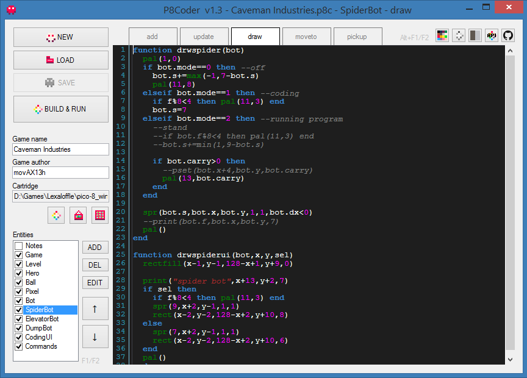
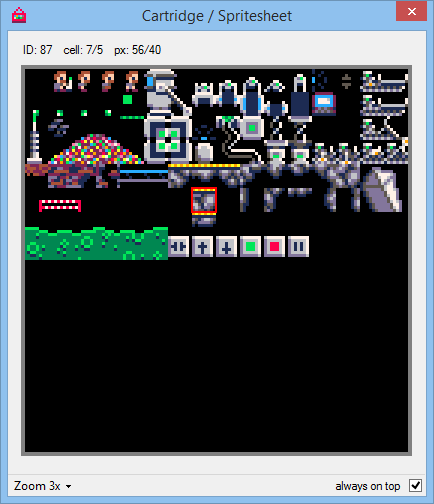
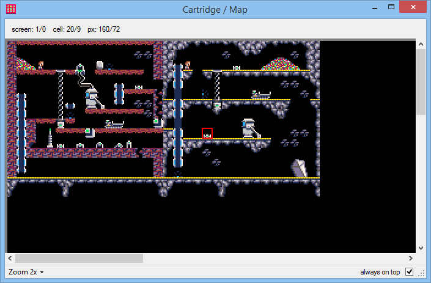
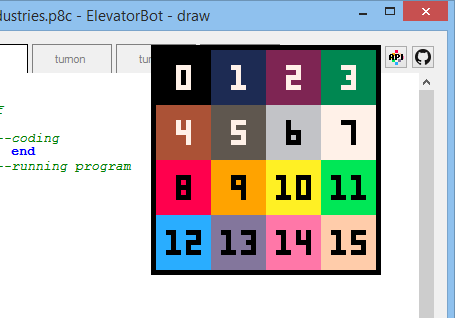
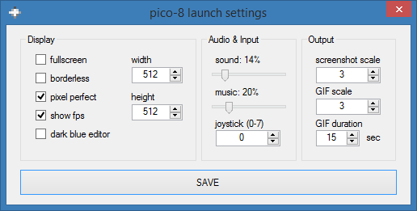

# P8Coder
P8Coder is a handy little tool that replaces the lua code in pico-8 cartridges (p8) with the code you write in P8Coder (Windows only, untested with Mono).

[Author release blog post](http://blog.thrill-project.com/p8coder-pico-8-programming-tool/)

It allows to group functions (any code actually) that belong to the same entity/unit in your game and lets you have functions (any kind of code sections) as tabs.

When writing to the cartridge it concatenates all code to one large lua code block as you would have when writing the cart directly in the p8 file or in pico-8.

In its functionality it serves the same way as a project explorer (multiple "files") and a code outline (functions list) but in P8Coder that's all just virtual (no files, just entries in a list). The structure of your projects is up to you.

It stores projects as p8c (P8Coder) files containing the code along with the path to the selected cartridge.

You can use upper-case characters in P8Coder for better readability. Everything will be converted to lower-case on build.

P8Coder has pico-8 lua syntax highlighting and API code hints and can be used entirely with keyboard (F1/F2 to switch entity, ALT+F1/F2 to switch tab, see tooltips for more):

Internal pico-8 spritesheet viewer with zoom and location helper:

Since version 1.2 there's a button in the top-right corner to save the spritesheet as png.

Internal pico-8 map viewer with zoom and location helper:

Pico-8 color table, [API cheatsheet](https://neko250.github.io/pico8-api/) and P8Coder GitHub page are just one click away:

Since v1.2 you can configure the way pico-8 launches when running your cartridge:

P8Coder watches changes made to sprites or map data of the loaded cartridge and updates its views automatically.

P8Coder project files (p8c) can be opened with P8Coder from Windows Explorer ("Open with..." and associate the file extension by choosing P8Coder.exe).

If you're looking for other tools for pico-8, check the [awesome-PICO-8](https://github.com/felipebueno/awesome-PICO-8) collection.

#### WARNING
P8Coder overwrites all lua code of the cartridge you select! Everything else (gfx/map/sfx/music) remains untouched.

## Download
- Binary from author server: http://thrill-project.com/archiv/coding/P8Coder.zip (150kb)
- Upgrade: replace the old exe with the new one

## Source code
- C# .NET4.5, VisualStudio 15 (2017) solution
- uses https://github.com/PavelTorgashov/FastColoredTextBox

## Change Log

- **1.8** - 2020-07-07
  - fixed: comment formatting thanks to nosnibor28

- **1.7** - 2020-06-23
  - fixed: syntax highlighter
  - added: new pico-8 keywords

- **1.6** - 2018-10-20
  - fixed: cart loading (label section)

- **1.5** - 2018-09-02
  - fixed: map preview (second half was scrambled)

- **1.4** - 2018-05-07
  - added: doubleclick on cart text field opens explorer and selects the cart
  - fixed: cart loading for new file format version (p8 sections are optional since pico-8 v0.1.11e)

- **1.3** - 2017-10-20
  - minor bugfixes
  - dark editor mode and toggle button

- **1.2** - 2017-10-02
  - pico-8 launch parameters dialog
  - button to save spritesheet to png
  - new instances of pico-8 instead of re-using
  
- **1.1** - 2016-11-01
  - fix for changed cartridge format
  
- **1.0** - 2016-05-13: public release